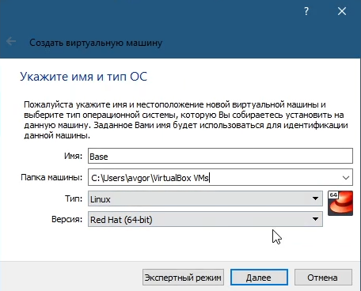

---
## Front matter
lang: ru-RU
title: Лабораторная работа №1
author: |
	Левкович К.А. - студент группы НКНбд-01-18
date: 18.09.2021

## Formatting
toc: false
slide_level: 2
theme: focus
header-includes: 
 -	\usefonttheme{serif}
 -	\usepackage{fontspec}  
 -	\setmainfont{Times New Roman} 

aspectratio: 43
section-titles: true
---

# Работа с виртуальной машиной

## Цель выполнения лабораторной работы

1. Приобретение практических навыков установки операционной системы на виртуальную машину;

2. Настройка минимально необходимых для дальнейшей работы сервисов.

## Задачи выполнения работы

1. Установить операционную систему Linux (дистрибутив CentOS) на виртуальную машину VirtualBox.

2. Установить дополнения для дальнейшей работы.

## Выполнение

- Создал виртуальную машину в VirtualBox

{ #fig:001 width=70% }

## Выполнение

- Настройка виртуальной машины

{ #fig:003 width=70% }

## Выполнение

- Установка операционной системы

{ #fig:007 width=50% }

## Выполнение

- Настройки операционной системы

{ #fig:008 width=70% }

## Выполнение

- Ошибка

{ #fig:011 width=50% }

## Выполнение

- Решение проблемы

{ #fig:010 width=70% }

## Выполнение

- Конечный результат

{ #fig:012 width=70% }

## Выводы

- Приобрел практические навыки установки операционной системы на виртуальную машину;

- Настроил минимально необходимые для дальнейшей работы сервисы.