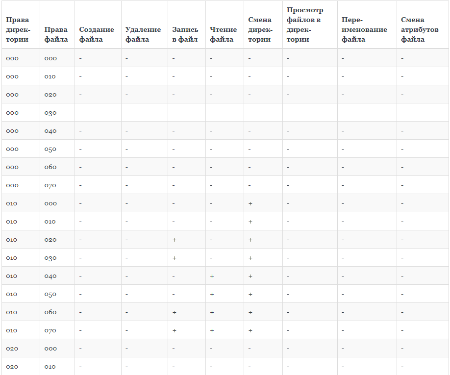

---
# Front matter
lang: ru-RU
title: "Лабораторная работа №3"
subtitle: "Информационная безопасность"
author: "Левкович Константин Анатольевич"

# Formatting
toc-title: "Содержание"
toc: true # Table of contents
toc_depth: 2
lof: true # List of figures
lot: true # List of tables
fontsize: 12pt
linestretch: 1.5
papersize: a4paper
documentclass: scrreprt
polyglossia-lang: russian
polyglossia-otherlangs: english
mainfont: PT Serif
romanfont: PT Serif
sansfont: PT Sans
monofont: PT Mono
mainfontoptions: Ligatures=TeX
romanfontoptions: Ligatures=TeX
sansfontoptions: Ligatures=TeX,Scale=MatchLowercase
monofontoptions: Scale=MatchLowercase
indent: true
pdf-engine: lualatex
header-includes:
  - \linepenalty=10 # the penalty added to the badness of each line within a paragraph (no associated penalty node) Increasing the value makes tex try to have fewer lines in the paragraph.
  - \interlinepenalty=0 # value of the penalty (node) added after each line of a paragraph.
  - \hyphenpenalty=50 # the penalty for line breaking at an automatically inserted hyphen
  - \exhyphenpenalty=50 # the penalty for line breaking at an explicit hyphen
  - \binoppenalty=700 # the penalty for breaking a line at a binary operator
  - \relpenalty=500 # the penalty for breaking a line at a relation
  - \clubpenalty=150 # extra penalty for breaking after first line of a paragraph
  - \widowpenalty=150 # extra penalty for breaking before last line of a paragraph
  - \displaywidowpenalty=50 # extra penalty for breaking before last line before a display math
  - \brokenpenalty=100 # extra penalty for page breaking after a hyphenated line
  - \predisplaypenalty=10000 # penalty for breaking before a display
  - \postdisplaypenalty=0 # penalty for breaking after a display
  - \floatingpenalty = 20000 # penalty for splitting an insertion (can only be split footnote in standard LaTeX)
  - \raggedbottom # or \flushbottom
  - \usepackage{float} # keep figures where there are in the text
  - \floatplacement{figure}{H} # keep figures where there are in the text
---

# Цель работы

Получение практических навыков работы в консоли с атрибутами файлов для групп пользователей.

# Выполнение лабораторной работы

## Создание учетных записей

Создаём новые учётные записи guest и guest2, используя учетную запись администратора и команду `useradd`.

После этого зададим пароль с помощью команды `passwd`, используя учетную запись администратора. (рис. -@fig:001)

{ #fig:001 width=70% }

## Вход в систему от двух пользователей

Добавляем пользователя guest2 в группу guest командой `gpasswd -a guest2 guest`.

Входим в систему в одной консоли от имени пользователя guest, определяем директорию, в которой находимся, с помощью команды pwd.

Аналогичные действия выполняем во второй консоли для пользователя guest2. (рис. -@fig:002)

{ #fig:002 width=70% }

## Принадлежность к группам

Для обоих пользователей уточняем имя пользователя, группу, кто в неё входит и к каким группам принадлежат пользователи.

С помощью команд `groups guest` и `groups guest2` определяем в какие группы входят пользователи guest и guest2. Результат индентичен выводу команд `id -Gn` и `id -G`. (рис. -@fig:003)

{ #fig:003 width=70% }

Также эту же информацию можно было получить, воспользовавшись командой `cat /etc/group`.

С помощью команды `newgrp guest` регистрируем пользователя guest2 в группе guest.

## Права и атрибуты

От имени пользователя guest изменяем права директории /home/guest, разрешив все действия для пользователей группы при помощи команды `chmod g+rwx /home/guest`.

От имени пользователя guest снимаем с директории /home/guest/dir1 все атрибуты командой `chmod 000 dirl`. (рис. -@fig:004)

{ #fig:004 width=70% }

## Таблица 3.1

Меняя атрибуты у директории dir1 и файла file1 от имени пользователя guest и делая проверку от пользователя guest2, заполняем таблицу: (рис. -@fig:005 — -@fig:008)

{ #fig:005 width=70% }
{ #fig:006 width=70% }
{ #fig:007 width=70% }
{ #fig:008 width=70% }

## Таблица 3.2

На основании заполненной таблицы определяем те или иные минимально необходимые права для выполнения пользователем guest2 операций внутри директории dir1 и заполняем таблицу 3.2. (рис. -@fig:009)

{ #fig:009 width=70% }

# Выводы

Получил практические навыки работы в консоли с атрибутами файлов для групп пользователей.