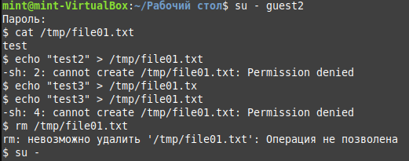

---
## Front matter
lang: ru-RU
title: Лабораторная работа №5
author: |
	Левкович К.А. - студент группы НКНбд-01-18
date: 13.11.2021

## Formatting
toc: false
slide_level: 2
theme: focus
header-includes: 
 -	\usefonttheme{serif}
 -	\usepackage{fontspec}  
 -	\setmainfont{Times New Roman} 

aspectratio: 43
section-titles: true
---

# Исследование влияния дополнительных атрибутов

## Цель выполнения лабораторной работы

1. Изучение механизмов изменения идентификаторов, применения SetUID- и Sticky-битов.;

2. Получение практических навыков работы в консоли с дополнительными атрибутами;

3. Рассмотрение работы механизма смены идентификатора процессов пользователей, а также влияние бита Sticky на запись и удаление файлов.

## Выполнение

- Написал программу simpleid от имени пользователя guest

{ #fig:001 width=70% }

## Выполнение

- Выполнил программу `id` и сравнил полученный результат с данными программы

{ #fig:002 width=70% }

## Выполнение

- Усложнил программу, добавив вывод действительных идентификаторов

{ #fig:003 width=50% }

## Выполнение

- Скомпилировал и запустил simpleid2.c `gcc simpleid2.c -o simpleid2`

{ #fig:004 width=70% }

## Выполнение

- Сменил у программы readfile владельца и установил SetU’D-бит

{ #fig:005 width=70% }

## Выполнение

- Проверка выполнения операций от пользователя guest2

{ #fig:006 width=70% }

## Выполнение

- Снял атрибут t с директории /tmp и повторил операции

{ #fig:007 width=70% }

## Выводы

- Изучил механизмы изменения идентификаторов, применения SetUID- и Sticky-битов. Получил практические навыки работы в консоли с дополнительными атрибутами. Рассмотрел работу механизма смены идентификатора процессов пользователей, а также влияние бита Sticky на запись и удаление файлов.